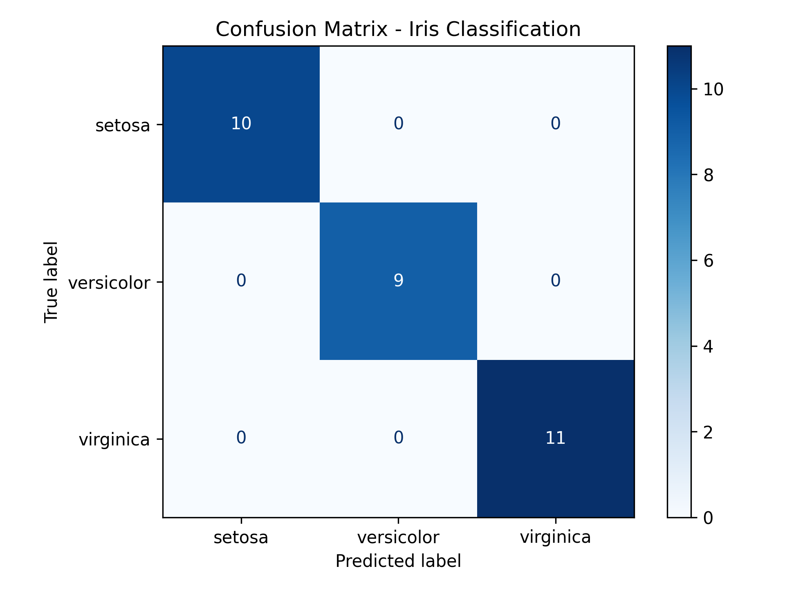

# 🧠 Confusion Matrix Evaluation - Iris Dataset

This project demonstrates how to train a classifier using the Iris dataset and evaluate its performance using a **Confusion Matrix**, along with metrics like **Accuracy**, **Precision**, **Recall**, and **F1-Score**. Visualization is done using `matplotlib`.

---

## 📌 Assignment Objectives

| Objective | Description |
|-----------|-------------|
| ✅ Train a Classifier | Train a model (Logistic Regression) on a dataset |
| ✅ Predict Outcomes | Use the model to predict test data |
| ✅ Confusion Matrix | Generate and visualize confusion matrix |
| ✅ Evaluation Metrics | Calculate Accuracy, Precision, Recall, F1-score |
| ✅ Visualization | Display confusion matrix with proper labels |

---

## 📊 Dataset Used

| Dataset | Source | Description |
|---------|--------|-------------|
| Iris Dataset | `sklearn.datasets.load_iris()` | A multiclass classification dataset with 150 flower samples and 3 species: *Setosa*, *Versicolor*, and *Virginica* |

Features:

- `sepal length (cm)`
- `sepal width (cm)`
- `petal length (cm)`
- `petal width (cm)`

Target classes:

- 0: Setosa
- 1: Versicolor
- 2: Virginica

---

## 🧪 Process Overview

| Step | Description | Code Snippet |
|------|-------------|--------------|
| **1** | Load the dataset | `from sklearn.datasets import load_iris` |
| **2** | Split into train & test | `train_test_split(X, y, test_size=0.2)` |
| **3** | Train classifier | `LogisticRegression().fit(X_train, y_train)` |
| **4** | Predict on test set | `model.predict(X_test)` |
| **5** | Create Confusion Matrix | `confusion_matrix(y_test, y_pred)` |
| **6** | Evaluate Metrics | `accuracy_score`, `precision_score`, `recall_score`, `f1_score` |
| **7** | Visualize | `ConfusionMatrixDisplay().plot()` |

---

## 📈 Evaluation Metrics

| Metric | Meaning |
|--------|---------|
| **Accuracy** | Overall correctness of predictions |
| **Precision** | How many predicted positives are actually correct |
| **Recall** | How many actual positives were correctly predicted |
| **F1-Score** | Harmonic mean of precision and recall (balance between the two) |

---

## 📊 Confusion Matrix

A **confusion matrix** shows the number of correct and incorrect predictions made by the classifier for each class.



---

## 🚀 How to Run

### 1. Install Requirements

```bash
pip install scikit-learn matplotlib
